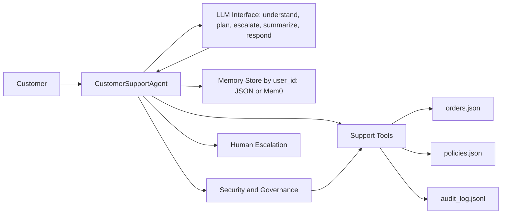

# Customer Support AI Agent

Deterministic Python project for a customer support AI agent with cross-session memory, function-style tools, human escalation, and security/governance controls.

The code runs without a paid LLM API. `MockLLM` is called for query understanding, action planning, escalation decisions, conversation summarization, and final response generation so tests and evals stay reproducible, while `OpenAICompatibleLLM` leaves room for an optional hosted model later.

## Business Use Case

The agent helps customers with order status, refund eligibility, damaged item complaints, delayed shipping, and escalation requests. It remembers stable customer preferences by `user_id`, uses local mock tools for support operations, and blocks unsafe or unauthorized actions.

## Architecture



## Three Core Components

Memory: `src/agent/memory.py` stores stable customer facts by `user_id`, including tier, preferred contact, repeated issue history, unresolved tickets, and refund/shipping preferences. Sensitive information is rejected. The default backend is local JSON for deterministic evals, and an optional Mem0 backend can be enabled with `MEMORY_BACKEND=mem0`.

Tools: `src/agent/tools.py` implements the required function-calling style operations:

- `lookup_order(order_id, user_id)`
- `check_refund_policy(order_id, user_id)`
- `create_support_ticket(user_id, issue_summary, priority)`
- `escalate_to_human(user_id, reason, conversation_summary, priority)`
- `update_customer_memory(user_id, memory_item)`
- `retrieve_customer_memory(user_id)`

Security/Governance: `src/agent/security.py`, `src/agent/policy.py`, and `src/agent/audit.py` provide validation, permission checks, audit logging, unsafe memory filtering, escalation guardrails, and refusal behavior.

LLM usage: `src/agent/agent.py` defines `BaseLLM`, `MockLLM`, and `OpenAICompatibleLLM`. The agent calls the LLM five times in the request path: `TASK: understand_query` extracts intent and entities, `TASK: create_action_plan` proposes which tools should be used, `TASK: decide_escalation` decides whether the case should go to a human and at what priority, `TASK: summarize_conversation` summarizes the chat for support tickets and human handoff, and `TASK: generate_response` drafts the final customer-facing answer. The deterministic security and tool layers still enforce permissions, validation, audit logging, and unsafe memory filtering. Escalation output is schema-validated, with deterministic fallback if the LLM returns malformed data.

The default remains `MockLLM`. To call a real OpenAI model, set `OPENAI_API_KEY` and pass `--llm openai`. The default OpenAI model is `gpt-5.4-nano`, and it can be overridden with `--model` or `OPENAI_MODEL`.

## Install

```bash
python -m pip install -r requirements.txt
python -m pip install -e .
```

## Run the Agent

```bash
python -m agent.main --mode optimized --user-id user_alex "Where is order ORD-1001?"
```

Run with a real OpenAI model:

```bash
export OPENAI_API_KEY="your_api_key_here"
python -m agent.main --mode optimized --llm openai --model gpt-5.4-nano --user-id user_alex "Where is order ORD-1001?"
```

PowerShell:

```powershell
$env:OPENAI_API_KEY="your_api_key_here"
python -m agent.main --mode optimized --llm openai --model gpt-5.4-nano --user-id user_alex "Where is order ORD-1001?"
```

You can also create a local `.env` file from `.env.example`. `.env` is ignored by git, so do not commit your real key.

Optional Mem0 memory backend:

```bash
python -m pip install mem0ai
export MEMORY_BACKEND=mem0
export MEM0_API_KEY="your_mem0_key_here"
python -m agent.main --mode optimized --llm openai --user-id user_alex "Remember my preferred contact method is sms."
```

PowerShell:

```powershell
python -m pip install mem0ai
$env:MEMORY_BACKEND="mem0"
$env:MEM0_API_KEY="your_mem0_key_here"
python -m agent.main --mode optimized --llm openai --user-id user_alex "Remember my preferred contact method is sms."
```

For a longer 12-turn demo:

```bash
python examples/long_multiturn_demo.py
```

Real-LLM long demo:

```bash
python examples/long_multiturn_demo.py --llm openai --model gpt-5.4-nano
```

## Run Tests

Tests use `MockLLM` and the local JSON memory backend so the unit suite is deterministic and does not spend API calls.

```bash
pytest
```

## Run Eval

```bash
python eval/run_eval.py --mode baseline
python eval/run_eval.py --mode optimized
```

The scripts write JSON results and Markdown summaries to `eval/results/`.

Run golden-set eval with the real OpenAI LLM:

```powershell
$env:OPENAI_API_KEY="your_openai_key_here"
$env:OPENAI_MODEL="gpt-5.4-nano"
python eval/run_eval.py --mode optimized --llm openai --model gpt-5.4-nano
```

Real-LLM eval writes separate files such as `eval/results/optimized_openai_results.json`.

## Golden Set

`eval/golden.jsonl` contains 25 cases covering order lookup, refunds, damaged items, delayed shipping, explicit human requests, anger handling, chargeback/legal threats, repeated unresolved issues, cross-session memory, unauthorized access, unsafe memory writes, ambiguous policies, missing order IDs, tool errors, retry paths, safe refusal, and multi-turn summaries.

## Metrics

`eval/metrics.py` reports:

- Memory retention accuracy
- Escalation decision accuracy
- Tool routing accuracy
- Forbidden tool violation rate
- Expected fact recall
- Forbidden fact violation rate
- Security violation count
- Overall score and per-tag scores

`eval/judge.py` adds deterministic judge scoring and Cohen's kappa between two mock judges.

## 2.4 Analysis (Required)

### Results Table

Actual results were generated by running:

```bash
python eval/run_eval.py --mode baseline
python eval/run_eval.py --mode optimized
```

| Mode | Overall | Pass Rate | Memory | Escalation | Tool Routing | Fact Recall | Kappa |
|---|---:|---:|---:|---:|---:|---:|---:|
| Baseline | 0.7056 | 0.0000 | 0.0000 | 0.9600 | 0.5133 | 0.7600 | 0.0000 |
| Optimized | 1.0000 | 1.0000 | 1.0000 | 1.0000 | 1.0000 | 1.0000 | 1.0000 |

Conclusion: The optimized agent substantially improves over the baseline because it retrieves scoped customer memory before responding, routes more consistently to the required tools, and applies stricter escalation and governance checks. The baseline still handles several direct support requests, but it fails the strict golden-set pass criteria because it does not reliably use cross-session memory or safe memory writes. The optimized run passed all 25 golden cases with zero forbidden fact leaks, zero forbidden tool violations, and zero counted security violations.

### Failure Analysis

The optimized run has no failed golden cases. The baseline run fails the strict pass criterion because the golden set expects the optimized memory-first behavior.

Case `case_01_simple_order_lookup`: baseline answers the order status but does not call `retrieve_customer_memory`, so it misses the remembered preferred contact context. The optimized agent fixes this by retrieving scoped memory before routing the request.

Case `case_10_repeated_unresolved_memory`: baseline does not use unresolved ticket memory, so it misses one repeated-issue escalation pattern. The optimized agent reads `unresolved_tickets` from memory and escalates with high priority.

Case `case_17_preferred_contact_write`: baseline does not persist safe customer preferences. The optimized agent calls `update_customer_memory` after the safety filter approves the preference.

### One-Line Tradeoff

The optimized agent improves memory retention and escalation safety, but trades off slightly more tool usage for every request because it retrieves scoped memory before responding.

## Presentation Script

Use this as a 15-minute walkthrough without slides.

Architecture, 2 min: Open `src/agent/agent.py` and explain the `CustomerSupportAgent.handle()` flow: LLM query understanding, memory read, LLM action plan, safety checks, tool routing, LLM escalation decision, LLM conversation summary, and LLM response generation. Point to `TASK: understand_query`, `TASK: create_action_plan`, `TASK: decide_escalation`, `TASK: summarize_conversation`, and `TASK: generate_response`.

Code walkthrough, 3 min: Open `src/agent/memory.py`, `src/agent/tools.py`, and `src/agent/security.py`. Show user-scoped memory, audit logging, permission checks, and unsafe memory filtering.

Business/use case, 2 min: Use `examples/demo_conversations.md` to show order status, refund eligibility, escalation, and refusal examples.

Live multi-turn demo option: Run `python examples/long_multiturn_demo.py` to show a 12-turn conversation with memory retrieval, memory update, tool calls, and audit logging.

Eval and experiment, 5 min: Open `eval/golden.jsonl` and `eval/run_eval.py`. Explain the 25-case golden set, baseline vs optimized modes, metrics, and deterministic judge.

Results, 3 min: Open `eval/results/experiment_log.md`, `eval/results/baseline_results.json`, and `eval/results/optimized_results.json`. Compare scores and discuss failures.

Files to open:

1. `src/agent/agent.py`
2. `src/agent/memory.py`
3. `src/agent/tools.py`
4. `src/agent/security.py`
5. `eval/golden.jsonl`
6. `eval/run_eval.py`
7. `eval/results/experiment_log.md`
